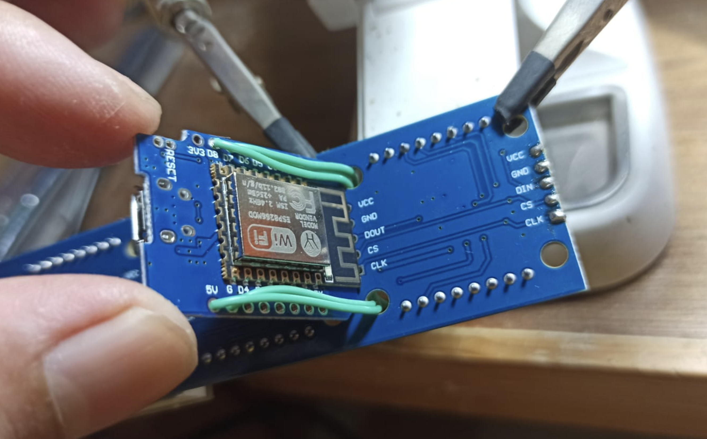

# Arduino-esp8266-mini-JWS

Mini JWS (Jam Waktu Sholat) dengan ESP8266 dan Matrix LED MAX7219

## Fitur

- Koneksi jam dengan wifi
- Seting jam dengan web base
- Update waktu ke NTP Server  
  Desain jam ini update waktu ke NTP server di internet (`time.google.com, pool.ntp.org, time.windows.com`), namun jika dalam jaringan (LAN) anda memiliki NTP server, maka jam bisa bekerja tanpa koneksi internet.  
  Untuk alamat NTP server bisa diganti pada seting jam.
  > Anda perlu menambahkan modul RTC dan memodifikasi kode jika ingin jam benar-benar offline.
- Beberapa tema jam
- Durasi pergantian dapat disesuaikan
- Menampilkan jam waktu sholat  
  - Perhitungan jam sholat menggunakan lokasi (koordinat) dan timezone
  - Metode perhitungan kemenag :
    - Subuh : 20 deg
    - Asar : Perbandingan bayangan 1 (Shafi'i dan lainnya)
    - Isya : 18 deg
  > CATATAN :  
  > Untuk library JWS yang digunakan adalah [Arduino-Prayer-Times](https://github.com/asmaklad/Arduino-Prayer-Times) yang merupakan adaptasi dari [http://praytimes.org/](http://praytimes.org/).  
  > Library ini sebenarnya mendukung beberapa metode perhitungan :
  >
  > - MWL : Muslim World League
  > - ISNA : Islamic Society of North America
  > - Egypt : Egyptian General Authority of Survey
  > - Makkah : Umm al-Qura University, Makkah
  > - Karachi : University of Islamic Sciences, Karachi
  > - Tehran : Institute of Geophysics, University of Tehran
  > - Jafari : Shia Ithna Ashari (Ja`fari)
  > - Custom : Custom setting
  >
  > Namun pada menu seting jam yang ditampilkan hanya metode kemenag (metode custom), jika anda memerlukan menggunakan metode perhitungan lain, anda harus mengganti di code nya

## Video Demo & Instalasi

[](https://youtu.be/aN8uahImBbo)

## Komponen

- ESP8266 board (Wemos, nodemcu, etc)
- Matrix led (MAX7219)
- 5V power supply (bisa menggunakan charger HP)

## Wiring




## Software , Driver dan Instalasi 

Baberapa board ESP8266 seperti wemos dan nodeMCU menggunakan chip CH340 untuk serial komunikas, anda bisa download drivernya dari link berikut:

- Install driver CH340 [check here](https://learn.sparkfun.com/tutorials/how-to-install-ch340-drivers/all)

> CATATAN :  
> Dalam beberapa kasus, untuk OS windows 10 dan windows 11, driver CH340 versi terbaru otomatis terinstal dari windows update, namun tidak bisa digunakan untuk upload sketch ke ESP8266.  
> Solusinya anda perlu install manual driver versi lama (link diatas)

Ada 2 cara untuk upload ke board ESP8622, silakan sesuaikan dengan kebutuhan anda.
(untuk lebih lengkapnya anda bisa lihat tutorial pada video diatas)

### 1. Dengan ESP Tool

Jika anda hanya ingin install saja tanpa modifikasi kode, menggunkan ESP Tool adalah cara yang cepat dan lebih mudah.  

- Cek port Wemos yang terkoneksi pada PC dari device manager
- Buka file `upload.bat` pada folder `bin` dengan text editor kemudian sesuaikan port-nya
- Jalankan `upload.bat`

  ```bat
    esptool.py v4.6.2
    Serial port COM10
    Connecting....
    Chip is ESP8266EX
    Features: WiFi
    Crystal is 26MHz
    MAC: 24:d7:eb:ca:6b:a4
    Uploading stub...
    Running stub...
    Stub running...
    Changing baud rate to 921600
    Changed.
    Configuring flash size...
    Flash will be erased from 0x00000000 to 0x00060fff...
    Compressed 394144 bytes to 280538...
    Wrote 394144 bytes (280538 compressed) at 0x00000000 in 4.0 seconds (effective 792.8 kbit/s)...
    Hash of data verified.

    Leaving...
    Hard resetting via RTS pin...
    Press any key to continue . . .
  ```

  > CATATAN :
  > - Tutorial diata adalah untuk OS Windows.
  > - Untuk OS lain silakan mendownload ESP Tool sesuai versi OS-nya [cek disini](https://github.com/espressif/esptool/releases)
  > - File bin (`wemos.bin`) adalah binary yang di compile untuk board wemos, tidak bisa digunakan untuk board ESP8266 yang lain.
  
### 2. Dengan Arduino IDE

Jika anda memerlukan untuk melakukan modifikasi kode, anda bisa menggunakan Arduino IDE.

- Install arduino IDE [cek disini](https://www.arduino.cc/)
- Tambahkan board ESP8266 pada arduino IDE [cek disini](https://github.com/esp8266/Arduino)
- Buka `code.ino` pada folder `code`
- Lakukan modifikasi kode jika diperlukan
- Sesuaikan jenis board dan port-nya, kemudian upload sketch.

## Box

Berikut adalah box yang pernah saya bikin dengan 3D Printer, namun untuk ukuran PCB modul matrix led tidak selalu sama, mungkin akan memerlukan beberapa penyesuaian dengan modul yang anda beli.


## Seting Jam

Secara default, saat pertama kali selesai diinstal perangkat akan menjadi access point wifi :

- SSID = JAM-JWS
- Tanpa password

Setelah melakukan koneksi dengan access point diatas, untuk masuk ke halaman seting jam silakan buka browser dengan alamat <http://10.10.10.10/> kemudian ikuti petunjuk yang ada dalam menu seting jam untuk mengkoneksikan jam dengan wifi dan melakukan setting JWS. (silakan buka video tutorial untuk lebih detailnya)

Perangkat akan otomatis menjadi access point kembali jika gagal melakukan koneksi dengan wifi (yang di set di seting jam).

## License and credits

My code under MIT license, other libraries follow their own license.

## Donation  

Support me  

- [Send me coffee](https://sociabuzz.com/fahroniganteng/tribe)
- [or maybe ice cream](https://trakteer.id/fahroniganteng/tip)
